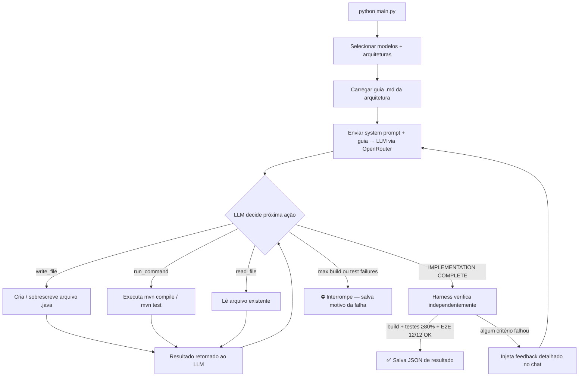

<div align="center">

# AI Coding Benchmark

**Série de experimentos medindo custo, velocidade e qualidade de modelos de IA gerando código para a mesma tarefa controlada.**

[](#experimento-01--java-vs-kotlin)
[](#experimento-02--padrões-arquiteturais)
[](#experimento-06--agentic-benchmark)

</div>

---

## Sobre o projeto

O benchmark mede uma única pergunta em três ângulos diferentes: **dado o mesmo problema, quanto custa, quanto tempo demora e qual é a qualidade do código gerado por diferentes modelos de IA?**

A tarefa é sempre a mesma — uma Task Manager REST API em Java/Spring Boot com 5 endpoints CRUD, validação de campos e cobertura de testes ≥ 80%. A especificação completa fica em [`shared/task-definition.md`](shared/task-definition.md) e nunca muda entre experimentos.

O que evolui é **quem controla o loop**:

| Experimento | Abordagem | Controle |
|---|---|---|
| Exp-01 / Exp-02 | Claude Code CLI | Humano dá o guia, agente executa |
| Exp-06 | OpenRouter API + tool use | LLM decide tudo de forma autônoma |

---

## Experimentos

| # | Nome | Variável testada | Ferramenta | Status | Detalhes |
|---|------|-----------------|------------|--------|----------|
| 01 | **Java vs Kotlin** | Linguagem | Claude Code · `claude-sonnet-4-6` | ✅ Concluído | [→ resultados](experiments/exp-01-java-vs-kotlin/README.md) |
| 02 | **Padrões Arquiteturais** | Arquitetura (7 padrões) | Claude Code · `claude-sonnet-4-6` | ✅ Concluído | [→ resultados](experiments/exp-02-arch-patterns/README.md) |
| 06 | **Agentic Benchmark** | Modelo + autonomia | OpenRouter · 5 modelos × 7 arquiteturas | 🔄 Em andamento | [→ harness](experiments/exp-06-agentic-benchmark/README.md) |

---

## Experimento 01 — Java vs Kotlin

| | Java | Kotlin |
|---|---|---|
| Custo | **$1,46** 🏆 | $3,50 |
| Duração | **5,4 min** 🏆 | 10,7 min |
| Cobertura linha | 89,1% | **94,3%** 🏆 |
| E2E (12 cenários) | 12/12 ✅ | 12/12 ✅ |

Java foi 2,4× mais barato e 2× mais rápido — provavelmente por ter mais exemplos nos dados de treinamento do modelo. Kotlin produz cobertura maior mas custa mais.

[→ Análise completa](experiments/exp-01-java-vs-kotlin/README.md)

---

## Experimento 02 — Padrões Arquiteturais

| Padrão | Custo | Duração | Erros de build | Cobertura linha | E2E |
|--------|-------|---------|---------------|-----------------|-----|
| MVC | $1,73 | 6,3 min | 5 | 93,0% | 12/12 ✅ |
| Vertical Slice | $3,84 | 5,4 min | 2 | 91,8% | 12/12 ✅ |
| Clean Architecture | $3,18 | 7,3 min | 1 | **97,0%** 🏆 | 12/12 ✅ |
| Hexagonal | $2,92 | 8,4 min | 6 | 93,6% | 12/12 ✅ |
| DDD Tático | $2,33 | **5,0 min** 🏆 | 1 | 88,0% | 12/12 ✅ |
| Event-Driven | **$2,22** 🏆 | 8,85 min | 5 | 90,0% | 12/12 ✅ |
| CQRS | $3,27 | 8,81 min | 2 | 95,0% | 12/12 ✅ |

Todos os 7 padrões produziram código funcional (12/12 E2E). A diferença está no custo e na quantidade de erros que o modelo precisou corrigir. Clean Architecture teve o menor número de erros e maior cobertura.

[→ Análise completa](experiments/exp-02-arch-patterns/README.md)

---

## Experimento 06 — Agentic Benchmark 🔄

### O que é diferente

Nos experimentos anteriores, o humano fornecia um guia `.md` e o Claude Code CLI executava as instruções. No exp-06, o humano sai do loop: o modelo recebe a especificação completa e **três ferramentas reais** — ele mesmo decide o que escrever, quando compilar e como corrigir os erros.

### Como o harness funciona



O LLM só sai do loop quando o harness confirma independentemente que **build compila, testes passam com ≥ 80% de cobertura e todos os 12 cenários E2E estão corretos**. Se declarar "IMPLEMENTATION COMPLETE" antes disso, recebe o feedback exato do que faltou e continua.

### Modelos avaliados

| Modelo | Provider | In ($/M tokens) | Out ($/M tokens) |
|--------|----------|-----------------|------------------|
| DeepSeek V3 | deepseek | $0,14 | $0,28 |
| Gemini 2.0 Flash | Google | $0,075 | $0,30 |
| Llama 3.3 70B | Meta | $0,10 | $0,20 |
| Claude Sonnet 4.5 | Anthropic | $3,00 | $15,00 |

### Métricas coletadas por run

Além dos critérios de qualidade (build, tests, E2E, arquitetura), cada run salva um objeto `agent_behavior` no JSON:

```json
"agent_behavior": {
  "total_tool_calls": 47,
  "tool_breakdown": { "run_command": 31, "write_file": 12, "read_file": 4 },
  "command_breakdown": { "mvn compile": 8, "mvn test": 6, "other": 17 },
  "convergence_reason": "success | gave_up | max_build_failures | max_test_failures | auth_error",
  "build_failures": 3,
  "test_failures": 1,
  "first_build_success_at_call": 5,
  "first_test_success_at_call": 23,
  "last_build_failure_output": "...",
  "last_test_failure_output": "..."
}
```

### Como rodar você mesmo

```bash
cd experiments/exp-06-agentic-benchmark
pip install -r requirements.txt
# Crie o arquivo .env com:
# OPENROUTER_API_KEY=sk-or-...
python main.py
```

[→ Documentação completa do harness](experiments/exp-06-agentic-benchmark/README.md)

---

## Estrutura do Repositório

```
benchmark/
├── experiments/
│   ├── exp-01-java-vs-kotlin/          # Experimento 1: Java vs Kotlin
│   │   ├── README.md                   # Resultados detalhados
│   │   ├── java-mode-1/                # Implementação Java — agente sequencial
│   │   ├── java-mode-2/                # Implementação Java — orquestrador + subagentes
│   │   ├── kotlin-mode-1/              # Implementação Kotlin — agente sequencial
│   │   ├── kotlin-mode-2/              # Implementação Kotlin — orquestrador + subagentes
│   │   ├── guides/                     # Guias de execução (benchmark-*.md)
│   │   └── results/                    # Métricas JSON e relatórios HTML
│   │
│   ├── exp-02-arch-patterns/           # Experimento 2: 7 padrões arquiteturais
│   │   ├── README.md                   # Resultados detalhados
│   │   ├── mvc/ vertical-slice/ ...    # Uma pasta por arquitetura
│   │   ├── guides/                     # Guias de execução (benchmark-arch-*.md)
│   │   └── results/
│   │
│   └── exp-06-agentic-benchmark/       # Experimento 6: LLM autônomo com tool use
│       ├── README.md                   # Documentação do harness
│       ├── main.py                     # TUI interativo (seleção de modelos + execução)
│       ├── benchmark_config.py         # Config do projeto (modelos, arquiteturas, regras)
│       ├── harness/                    # Loop agentico, tools, métricas
│       ├── guides/                     # Um .md por arquitetura (prompt do experimento)
│       ├── implementations/            # Código gerado — modelo/arquitetura/src
│       └── results/                    # JSONs de resultado por run
│
├── shared/
│   ├── task-definition.md              # Especificação CRUD usada por todos os experimentos
│   └── docs/                           # Guias teóricos de cada padrão arquitetural
│
└── tools/
    ├── collector.py                    # Extrai tokens/custo/velocidade de sessões Claude Code
    ├── snapshot.py                     # Snapshot pré/pós sessão
    ├── compare.py                      # Tabela comparativa em Markdown
    └── report.py                       # Relatório HTML interativo (Chart.js)
```

---

## Guias Teóricos de Arquitetura

Os documentos em [`shared/docs/`](shared/docs/) explicam cada padrão com diagramas e análise dos resultados:

[MVC](shared/docs/arch-mvc.md) · [Vertical Slice](shared/docs/arch-vertical-slice.md) · [Clean Architecture](shared/docs/arch-clean.md) · [Hexagonal](shared/docs/arch-hexagonal.md) · [DDD](shared/docs/arch-ddd.md) · [Event-Driven](shared/docs/arch-event-driven.md) · [CQRS](shared/docs/arch-cqrs.md)

---

<div align="center">

Rode você mesmo e compare com os seus resultados.

[](LICENSE)

</div>
