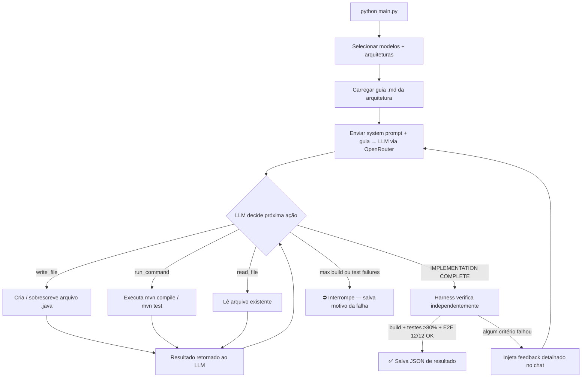
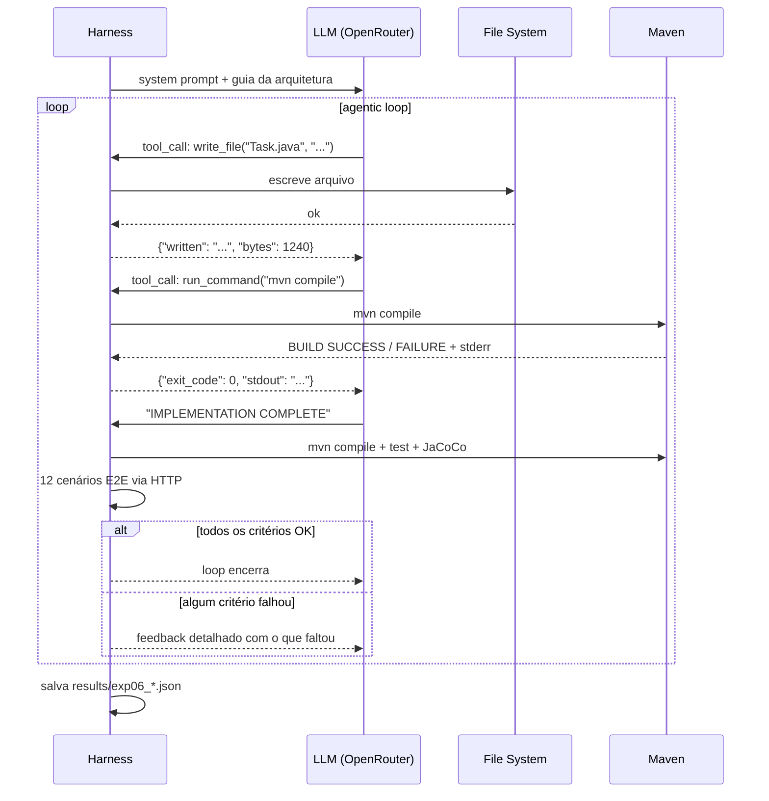

# Exp-06 — Agentic Benchmark

> LLMs autônomos implementando a mesma Task Manager API via tool use — sem interferência humana no loop.

---

## O que é

Nos experimentos anteriores (exp-01, exp-02), um humano fornecia um guia `.md` e o Claude Code CLI executava as instruções passo a passo. O humano ainda controlava o ritmo: definia as fases, corrigia o rumo, aprovava o resultado.

O exp-06 remove o humano do loop. O modelo recebe a especificação completa da tarefa, três ferramentas para interagir com o sistema de arquivos e o compilador, e **decide sozinho** o que escrever, quando compilar, o que corrigir e quando parar.

Isso mede uma capacidade diferente: **autonomia e raciocínio sequencial**, não só qualidade de código em tentativas guiadas.

---

## Diferença dos experimentos anteriores

| Dimensão | Exp-01 / Exp-02 | Exp-06 |
|---|---|---|
| Quem controla o loop | Humano via prompt | LLM via tool use |
| Ferramenta | Claude Code CLI | OpenRouter API |
| Fases de execução | Guiadas pelo humano | Livres — LLM escolhe a ordem |
| Como o código é escrito | Agente usa editor interno | LLM chama `write_file` explicitamente |
| Critério de término | Humano aprova | Harness verifica independentemente |
| Métrica de processo | Aider calls por fase | Tool calls totais + breakdown por tipo |

---

## O que é um harness

O termo vem da engenharia: um *harness* (arnês) é o conjunto de cabos e conectores que liga componentes de um sistema sem fazer parte da lógica deles — existe apenas para rotear sinais. No carro, o arnês elétrico conecta sensores, atuadores e a ECU sem ser nenhum deles.

No software, um *test harness* é a infraestrutura que **envolve** um sistema sob teste: fornece entradas controladas, executa as chamadas, captura saídas e avalia resultados de forma completamente independente da implementação. O sistema não sabe que está sendo avaliado; o harness observa de fora.

Aqui, o sistema sob teste é o **LLM**. O harness:
- Fornece as 3 ferramentas (`write_file`, `run_command`, `read_file`) como interface controlada
- Executa cada chamada de ferramenta de verdade — disco real, Maven real, sem simulação
- Registra todo o comportamento do modelo (quantas chamadas, quais erros, quanto tempo para compilar)
- Avalia o resultado **de forma independente**: quando o LLM declara que terminou, o harness compila, testa e roda os 12 cenários E2E por conta própria, sem confiar na palavra do modelo

O harness é o **árbitro**, não o colaborador. O LLM pode mentir ou se enganar — o harness verifica.

---

## Como o harness funciona

### Visão estrutural

```
┌─────────────────────────────── HARNESS ─────────────────────────────────┐
│                                                                          │
│  ┌──────────────────┐  tool_call (JSON)  ┌─────────────────────────┐   │
│  │                  │ ─────────────────► │                         │   │
│  │   LLM            │                    │   ToolExecutor          │   │
│  │  (OpenRouter API)│ ◄───────────────── │                         │   │
│  │                  │   result (JSON)    │  run_command()          │   │
│  └────────┬─────────┘                    │  write_file()           │   │
│           │                              │  read_file()            │   │
│           │ "IMPLEMENTATION              └──────────┬──────────────┘   │
│           │  COMPLETE"                              │                  │
│           ▼                                         │ subprocess /     │
│  ┌──────────────────┐                               │ disk I/O        │
│  │                  │                   ┌──────────▼──────────────┐   │
│  │  MetricsEvaluator│◄── mvn compile ───│                         │   │
│  │  (independente)  │◄── mvn test   ────│  File System + Maven    │   │
│  │                  │◄── 12x HTTP E2E ──│  (projeto Java real)    │   │
│  └────────┬─────────┘                   └─────────────────────────┘   │
│           │                                                             │
│           │ OK  → salva JSON + encerra loop                            │
│           │ NOK → injeta feedback → loop continua                      │
└───────────┼─────────────────────────────────────────────────────────────┘
            ▼
    results/exp06_<modelo>_<arch>_<ts>.json
```

### Fluxo de decisão



### Troca de mensagens ao longo do tempo



### Condições de término

O loop só termina em três situações:
1. **Sucesso**: harness confirma que build compila, testes passam com ≥ 80% de cobertura e os 12 cenários E2E estão corretos.
2. **Limite de falhas**: o modelo atingiu o máximo configurado de falhas consecutivas de build ou teste.
3. **Desistência**: o modelo para de usar ferramentas sem sinalizar conclusão.

---

## As 3 ferramentas

| Ferramenta | O que faz | Por que existe |
|---|---|---|
| `write_file(path, content)` | Cria ou sobrescreve um arquivo com conteúdo completo | Escrever Java via shell é frágil — aspas, `$`, `{` têm significados especiais que corrompem o arquivo silenciosamente |
| `run_command(command)` | Executa um comando no diretório do projeto | Compilar, testar, listar arquivos, verificar saída do Maven |
| `read_file(path)` | Lê um arquivo existente | O modelo precisa ver o que já escreveu antes de corrigir |

---

## Loop de verificação independente

Quando o LLM escreve `IMPLEMENTATION COMPLETE`, o harness **não confia** — roda a verificação por conta própria:

```
1. mvn compile          → build compila?
2. mvn test + JaCoCo    → todos os testes passam? cobertura de linha ≥ 80%?
3. 12 cenários E2E HTTP → todos os endpoints respondem corretamente?
```

Se qualquer critério falhar, o harness injeta no chat um feedback detalhado com o resultado exato:

```
Harness verification FAILED after your IMPLEMENTATION COMPLETE claim.

Unit tests: 15/16 passed — fix the failing tests.
Coverage: 0.0% — need ≥80%. Add more test cases to cover uncovered code paths.
E2E scenarios: 9/12 passed. Failing:
  - E2E-03: POST sem title 400 expected=400 got=500
  - E2E-07: GET invalido 404 expected=404 got=400

Fix all issues above, then declare IMPLEMENTATION COMPLETE again.
```

O LLM só sai do loop quando todos os critérios passam simultaneamente.

---

## Métricas salvas por run

Cada run salva um JSON em `results/` com dois blocos principais:

**Qualidade do código** (avaliação independente do harness):
```json
{
  "build":      { "success": true },
  "unit_tests": { "pass": true, "total": 16, "passed": 16, "failed": 0 },
  "e2e":        { "passed": 12, "all_passed": true },
  "architecture": { "violations": [], "ok": true }
}
```

**Comportamento do agente** (como o modelo trabalhou):
```json
{
  "agent_behavior": {
    "total_tool_calls": 47,
    "tool_breakdown":    { "run_command": 31, "write_file": 12, "read_file": 4 },
    "command_breakdown": { "mvn compile": 8, "mvn test": 6, "other": 17 },
    "convergence_reason": "success",
    "build_failures": 3,
    "test_failures":  1,
    "first_build_success_at_call": 5,
    "first_test_success_at_call": 23,
    "last_build_failure_output": "...",
    "last_test_failure_output":  "..."
  }
}
```

`convergence_reason` pode ser: `success` · `gave_up` · `max_build_failures` · `max_test_failures` · `auth_error` · `no_tool_support`

---

## Modelos avaliados

| Modelo | ID OpenRouter | In ($/M tok) | Out ($/M tok) | Tool use |
|--------|---------------|-------------|--------------|----------|
| DeepSeek V3 | `deepseek/deepseek-chat` | $0,14 | $0,28 | ✅ |
| Gemini 2.0 Flash | `google/gemini-2.0-flash-001` | $0,075 | $0,30 | ✅ |
| Llama 3.3 70B | `meta-llama/llama-3.3-70b-instruct` | $0,10 | $0,20 | ✅ |
| Claude Sonnet 4.5 | `anthropic/claude-sonnet-4-5` | $3,00 | $15,00 | ✅ |

Cada modelo é testado nas 7 arquiteturas: `mvc`, `vertical-slice`, `clean-architecture`, `hexagonal`, `ddd`, `event-driven`, `cqrs`.

---

## Como rodar você mesmo

**Pré-requisitos:**
```bash
java -version    # Java 21+
mvn -version     # Maven 3.9+
python --version # Python 3.10+
```

**Setup:**
```bash
cd experiments/exp-06-agentic-benchmark
pip install -r requirements.txt
```

Crie o arquivo `.env` na pasta do experimento:
```
OPENROUTER_API_KEY=sk-or-...
```

**Execução:**
```bash
python main.py
```

O TUI interativo oferece três opções:
- **Benchmark automático** — seleciona modelos, arquiteturas e limites de falha; executa em sequência; exibe tabela de resultados ao final
- **Chat interativo** — conversa diretamente com o modelo; ele pode executar benchmarks como resposta
- **Limpar arquivos** — remove `.java`, `target/` e JSONs gerados

---

## Estrutura de arquivos

```
exp-06-agentic-benchmark/
│
├── main.py                 # TUI principal (Rich) — entrada do usuário
├── chat.py                 # Modo chat interativo com o modelo
├── benchmark_config.py     # Config do projeto: modelos, arquiteturas, regras de domínio
├── requirements.txt        # openai, requests, python-dotenv, rich
├── .env                    # OPENROUTER_API_KEY (não commitado)
│
├── harness/
│   ├── harness.py          # BenchmarkHarness — loop agentico principal
│   ├── tools.py            # ToolExecutor — implementa write_file, run_command, read_file
│   ├── metrics.py          # Avaliação independente: build, tests, E2E, arquitetura
│   └── terminal.py         # Detecção de ambiente: WSL2, Git Bash, PowerShell, Unix
│
├── guides/
│   ├── benchmark-arch-mvc.md
│   ├── benchmark-arch-vertical-slice.md
│   ├── benchmark-arch-clean-architecture.md
│   ├── benchmark-arch-hexagonal.md
│   ├── benchmark-arch-ddd.md
│   ├── benchmark-arch-event-driven.md
│   └── benchmark-arch-cqrs.md
│   # Cada guia descreve a arquitetura e instrui o LLM com variáveis $src_base, $prod_files, etc.
│
├── implementations/
│   └── <modelo>/<arquitetura>/   # pom.xml pré-configurado + código gerado pelo LLM
│       ├── pom.xml               # Spring Boot 3.2 + JaCoCo 0.8.11 (não modificado)
│       └── src/                  # Gerado autonomamente pelo LLM durante o benchmark
│
└── results/
    └── exp06_<modelo>_<arch>_<ts>.json   # Um JSON por run com todas as métricas
```
